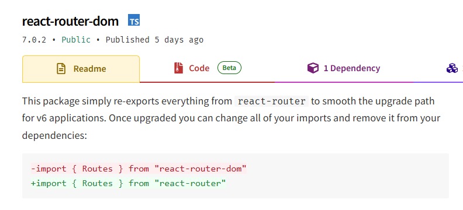

# Notas sobre el Challenge

Pueden acceder al sitio publicado en https://chaindots-challenge.netlify.app/

## Aclaración
En los requisitos del challenge se especificaba que para el manejo de las rutas se utilice la librería **react-router-dom**.  
Sin embargo, dicha librería está obsoleta y, hoy en día, es solo un export de la librería **react-router**, por lo que se avanzará instalando directamente esta última.

## Consideraciones
- Entiendo que la arquitectura de la aplicacion es excesiva para sus propias necesidades. Se ha hecho esta eleccion unicamente para satisfacer los requisitos del challenge.
- La decisión de utilizar javascript y no typescript como lenguaje fue tomada unicamente por cuestiones de agilidad y velocidad al momento de escribir el codigo.

## Pasos  para configurar la clave API de RapidAPI.

### 1. Seleccionar una API
Para este proyecto se utilizaron dos apis. Para hacer la busqueda de ciudades por nombre se utilizó la API **Weatherapi** y para obtener el pronostico extendido de cinco días **Weatherbit**, ya que el pronostico extendido **Weatherapi** solo llega a 3 días y **Weatherbit** no tiene busqueda por nombre de ciudad.

### 2. Configurar la API en RapidAPI
1. Iniciar sesión en [RapidAPI](https://rapidapi.com/).  
2. Suscribirse a la API elegida.  
3. Elegir un plan.  
   - Para este proyecto se eligió el **plan gratuito**.

### 3. Obtener y configurar la API Key
- Una vez suscrito, en el dashboard para pruebas debería estar la **API Key**.  
- La API Key debe enviarse en los **headers** de las peticiones con las siguientes claves:
  - **`x-rapidapi-key`**: La API Key obtenida.
  - **`x-rapidapi-host`**: El valor debe ser `'x-rapidapi-host'`.

## Pasos para levantar el entorno local.
Se trabajo en el proyecto con node v22.12.0 y npm v10.9.0
- Crear un archivo .env en la raiz del proyecto y colocar las API Key de **Weatherapi** y **Weatherbit** con los nombres **VITE_WEATHERAPI_KEY** y **VITE_WEATHERBIT_KEY**
- Ejecutar el comando npm run dev
- Por ultimo brir en el navegador http://localhost:5173/

